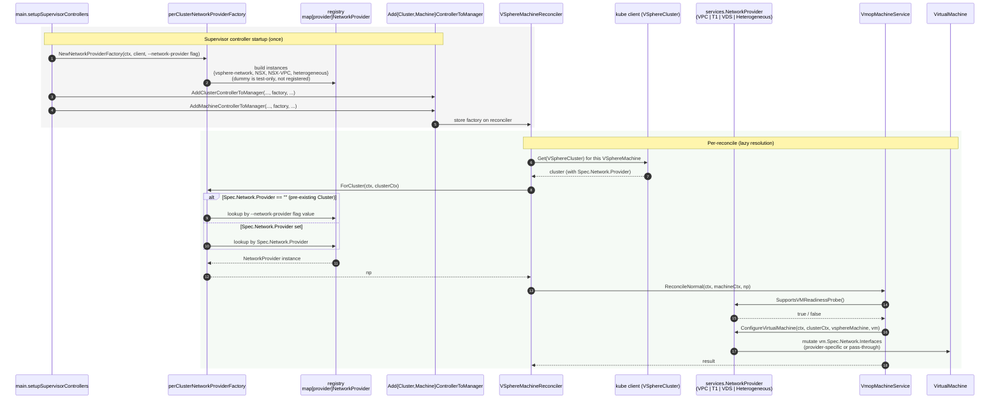

# Design: Per-Cluster Network Provider in CAPV

> Scope: CAPV-only. This doc covers the changes inside
> `cluster-api-provider-vsphere` to support a per-`VSphereCluster` network
> provider, lazily resolved at reconcile time. Upstream pieces (Net Operator
> `NetworkSettings`, the per-Cluster network provider label, the CAPI Runtime
> Extension, the GCC mutating/validating webhooks, and VKS capability flags)
> are described only as they affect CAPV's inputs. See:
>
> - `docs/One-Pager_Support_VKS_Cluster_Transition_to_VPC.md`
> - `docs/One-Pager_Support_Heterogeneous_Network_Providers_for_Supervisor_Cluster.md`

## 1. Background

Today CAPV picks the network provider once, from the `--network-provider`
command-line flag, and holds a single `services.NetworkProvider` instance for
the entire process lifetime. That instance is consumed in:

- `controllers/vmware/vspherecluster_reconciler.go` — `r.NetworkProvider`
  drives `ProvisionClusterNetwork`, `HasLoadBalancer`, and
  `ReconcileControlPlaneEndpointService`.
- `controllers/vspheremachine_controller.go` — `r.networkProvider` drives
  `ConfigureVirtualMachine`, and its `SupportsVMReadinessProbe()` value is
  captured **once at controller construction** into
  `vmoperator.VmopMachineService.ConfigureControlPlaneVMReadinessProbe`.
- `internal/webhooks/vmware/{vspherecluster,vspheremachine,vspheremachinetemplate}.go` —
  the same flag value is injected as a string and used to pick per-provider
  validation rules.

This is incompatible with the per-namespace provider model introduced for the
VKS Cluster Transition to VPC and the heterogeneous Supervisor Cluster, where
a single CAPV process serves clusters with different providers
(`vsphere-distributed`, `nsx-tier1`, `nsx-t_vpc`, and `heterogeneous`).

## 2. Goals

- Resolve the network provider per `VSphereCluster`, on demand, at every
  reconcile and every admission call.
- Source-of-truth for "which provider does this cluster use" is the new
  `VSphereCluster.spec.network.provider` field. The CAPI Runtime Extension
  populates it from the per-Cluster network provider label (out of CAPV
  scope).
- Keep the existing `--network-provider` flag path bit-for-bit compatible
  when the new feature gate is off.
- Add a `heterogeneous` provider for the Supervisor Cluster only: it
  propagates `VSphereMachine.spec.network.interfaces` straight through to
  `VirtualMachine.spec.network.interfaces` and skips per-provider
  defaulting/validation.

## 3. Non-Goals

- Authoring or maintaining the per-Cluster network provider label, the
  Cluster mutating/validating webhooks, or the CAPI Runtime Extension —
  these live outside CAPV.
- Changing any concrete provider's internal logic
  (`netop_provider.go`, `nsxt_provider.go`, `nsxt_vpc_provider.go`,
  `dummy_provider.go`).
- Changing the `services.NetworkProvider` interface signatures.

## 4. Feature Gates

We reuse the existing `feature.Gates` machinery
(`feature/feature.go`).

| Gate | Default | Purpose |
|---|---|---|
| `PerClusterNetworkProvider` (new) | `false` (alpha) | Master switch. When **off**, CAPV behaves exactly as today: the `--network-provider` flag selects one global provider. When **on**, `VSphereCluster.spec.network.provider` is the source of truth. |
| `MultiNetworks` (existing) | unchanged | Already gates `VSphereMachine.spec.network.interfaces`. Unaffected. |

> Naming note: we picked `PerClusterNetworkProvider` (CAPV-internal) rather
> than `PerNamespaceNetworkProvider` (the upstream/VKS doc name) because the
> CAPV-side dispatch keys off a per-cluster spec field, not a namespace CR.
> The two gates are intended to be flipped together in a Supervisor that
> supports the feature.

## 5. API Changes

### 5.1 `VSphereCluster.spec.network.provider`

Add a new optional field to `vmwarev1.Network`
(`api/supervisor/v1beta2/vspherecluster_types.go`):

```go
// NetworkProvider is the network provider used by this cluster.
// One of: "vsphere-network", "NSX", "NSX-VPC", "heterogeneous".
// Populated by the CAPI Runtime Extension from the per-Cluster
// network provider label. Required when the PerClusterNetworkProvider
// feature gate is enabled.
// +optional
// +kubebuilder:validation:Enum=vsphere-network;NSX;NSX-VPC;heterogeneous
Provider string `json:"provider,omitempty"`
```

CRD-level validation (`+kubebuilder:validation:XValidation`):

- `Provider` is **immutable** once set. Transitioning a brownfield namespace
  re-labels the workload Cluster but never flips its CAPV provider value
  (per the VKS transition design — existing Clusters keep their original
  per-cluster provider after the namespace moves to VPC).

The string values reuse the existing constants in `pkg/manager/network.go`
(`VDSNetworkProvider`, `NSXNetworkProvider`, `NSXVPCNetworkProvider`) plus a
new `HeterogeneousNetworkProvider = "heterogeneous"`.

### 5.2 Webhook validation rules (CAPV)

When `PerClusterNetworkProvider` is **off**: behavior is unchanged. The
flag-derived `webhook.NetworkProvider` string is the active provider for all
clusters.

When `PerClusterNetworkProvider` is **on**, the active provider for any
admission decision is read from the cluster the object belongs to:

| Webhook | Today | New (gate on) |
|---|---|---|
| `VSphereCluster` (`internal/webhooks/vmware/vspherecluster.go`) | `webhook.NetworkProvider != NSXVPCNetworkProvider` rejects `nsxVPC`. | Compare `cluster.Spec.Network.Provider` to `NSXVPCNetworkProvider` instead. **Update** must reject mutation of `Provider` once it's set. When `Provider == ""` (pre-existing Cluster), use the `--network-provider` flag value for the admission decision only; do not write it back into `cluster.Spec.Network.Provider`. |
| `VSphereMachine` (`internal/webhooks/vmware/vspheremachine.go`) | `validateNetwork(webhook.NetworkProvider, ...)` switches on the flag. | Look up the owning `VSphereCluster` via the `cluster.x-k8s.io/cluster-name` label and use `cluster.Spec.Network.Provider`. When `Provider == ""` (pre-existing Cluster), fall back to the `--network-provider` flag value. For `Provider == "heterogeneous"`: skip the per-provider switch, keep only the structural checks (interface-name uniqueness). If the owning cluster cannot be loaded at all (e.g., transient API error), surface the error so the apiserver retries the admission. |
| `VSphereMachineTemplate` (`internal/webhooks/vmware/vspheremachinetemplate.go`) | Same as `VSphereMachine`. | Same resolution & fallback rule as `VSphereMachine`. |

The webhook's `NetworkProvider string` field stays for the gate-off path
and as the fallback for empty `Provider` under gate-on. See §8.2 for the
rationale.

### 5.3 VSphereMachine `interfaces` — gate-on rules

For each provider value, the validation rules are:

- `vsphere-network` (VDS) — **unchanged**: `primary` forbidden, `secondary`
  must be `netoperator.vmware.com/Network`.
- `NSX` (T1) — **unchanged**: `interfaces` not supported.
- `NSX-VPC` — **unchanged**: `primary` must be VPC `SubnetSet`,
  `secondary` may be VPC `SubnetSet` or `Subnet`.
- `heterogeneous` — **new**: skip the provider switch. Apply only:
  - `MultiNetworks` gate must be on.
  - Interface names must be unique
    (existing `interfaceNames` check in `validateNetwork`).
- empty `Provider` — fall back to the `--network-provider` flag value and
  apply that provider's rules. Existing Clusters that pre-date the
  per-cluster label rollout retain their original (global) provider's
  validation behavior. New Clusters never hit this branch because the
  Runtime Extension populates `Provider` at create time.

## 6. The `NetworkProviderFactory`

### 6.1 Interface

A new abstraction in `pkg/manager/network.go`:

```go
// NetworkProviderFactory resolves the right NetworkProvider for a given
// VSphereCluster reconcile. Implementations are expected to be cheap and
// safe for concurrent use.
type NetworkProviderFactory interface {
    // ForCluster returns the NetworkProvider that should drive reconciles
    // for clusterCtx.VSphereCluster. Never returns nil on success.
    //
    // Resolution order under the perCluster implementation:
    //   1. clusterCtx.VSphereCluster.Spec.Network.Provider, if non-empty.
    //   2. The --network-provider flag value (gate-on fallback for
    //      pre-existing Clusters).
    //   3. An error, only if neither (1) nor (2) names a known provider.
    ForCluster(ctx context.Context, clusterCtx *vmware.ClusterContext) (services.NetworkProvider, error)
}
```

### 6.2 Implementations

Two implementations, selected at manager startup by the
`PerClusterNetworkProvider` gate:

```text
                                 +--------------------------------+
PerClusterNetworkProvider = off  | staticNetworkProviderFactory   |
                                 |  built from --network-provider |
                                 +--------------------------------+
                                 +----------------------------------------+
PerClusterNetworkProvider = on   | perClusterNetworkProviderFactory       |
                                 |  + map[string]services.NetworkProvider |
                                 |  + fallback to --network-provider      |
                                 |    when Spec.Network.Provider == ""    |
                                 +----------------------------------------+
```

- `staticNetworkProviderFactory` holds one `services.NetworkProvider` and
  always returns it. This is the gate-off path; behaviorally identical to
  today.
- `perClusterNetworkProviderFactory` holds a small registry of pre-built
  provider instances (one per kind: VDS, NSX, NSX-VPC, heterogeneous).
  `ForCluster` looks at `clusterCtx.VSphereCluster.Spec.Network.Provider`
  and returns the matching instance. When the field is empty (existing
  Cluster created before the per-cluster label was rolled out), it falls
  back to the `--network-provider` flag value (see §8). New Clusters always
  have the field populated by the Runtime Extension at create time, so the
  fallback only fires for pre-existing Clusters.

> Why a registry of singletons: the four concrete providers are stateless
> apart from a `client.Client` reference; sharing instances avoids
> per-reconcile allocation. The registry is built once during manager
> startup using the existing `GetNetworkProvider` constructor for each kind.

### 6.3 Wiring

The factory is constructed once at startup, on the supervisor path only,
and threaded into the supervisor controllers as an explicit parameter.
It is **not** stored on `ControllerManagerContext` — keeping the
dependency in the function signature avoids the import-cycle
(`pkg/context` → `pkg/services`) that an `any`-typed field would
otherwise need to paper over, and keeps the factory swappable in tests
without a global override.

`main.go`'s `setupSupervisorControllers` builds the factory immediately
before wiring the supervisor cluster/machine controllers:

```go
networkProviderFactory, err := manager.NewNetworkProviderFactory(
    ctx, controllerCtx.Client, controllerCtx.NetworkProvider,
)
if err != nil {
    return fmt.Errorf("unable to create network provider factory: %w", err)
}

if err := controllers.AddClusterControllerToManager(
    ctx, controllerCtx, mgr, true, networkProviderFactory,
    concurrency(vSphereClusterConcurrency),
); err != nil { return err }

if err := controllers.AddMachineControllerToManager(
    ctx, controllerCtx, mgr, true, networkProviderFactory,
    concurrency(vSphereMachineConcurrency),
); err != nil { return err }
```

`setupVAPIControllers` (the govmomi path) passes `nil` for the factory;
`Add{Cluster,Machine}ControllerToManager` only require it when their
`supervisorBased` argument is `true` and return an error otherwise:

```go
if supervisorBased && networkProviderFactory == nil {
    return fmt.Errorf("networkProviderFactory is required for supervisor-based ...")
}
```

`NewNetworkProviderFactory` returns `staticNetworkProviderFactory` when
the gate is off and `perClusterNetworkProviderFactory` when it is on.

## 7. Controller Changes

### 7.1 `controllers/vspherecluster_controller.go` (setup)

Today this builds one `NetworkProvider` and passes it to the supervisor
reconciler:

```62:68:controllers/vspherecluster_controller.go
networkProvider, err := inframanager.GetNetworkProvider(ctx, controllerManagerCtx.Client, controllerManagerCtx.NetworkProvider)
```

After, `AddClusterControllerToManager` accepts the factory as a
parameter (built in `main.go` — see §6.3) and forwards it to the
reconciler:

```go
func AddClusterControllerToManager(
    ctx context.Context,
    controllerManagerCtx *capvcontext.ControllerManagerContext,
    mgr manager.Manager,
    supervisorBased bool,
    networkProviderFactory services.NetworkProviderFactory,
    options controller.Options,
) error {
    if supervisorBased {
        if networkProviderFactory == nil {
            return fmt.Errorf("networkProviderFactory is required for supervisor-based AddClusterControllerToManager")
        }
        reconciler := &vmware.ClusterReconciler{
            ...
            NetworkProviderFactory: networkProviderFactory,
        }
        ...
    }
}
```

`vmware.ClusterReconciler.NetworkProvider` is removed. (Field renamed +
typed.)

### 7.2 `controllers/vmware/vspherecluster_reconciler.go`

At the top of `reconcileNormal` (or whichever entry resolves the cluster
context), call the factory once and pass `np` to every downstream call:

```go
np, err := r.NetworkProviderFactory.ForCluster(ctx, clusterCtx)
if err != nil {
    // Only fires for an unknown provider value; empty Provider falls back
    // to the --network-provider flag inside the factory.
    return ctrl.Result{}, err
}
```

Then replace the five `r.NetworkProvider.*` uses with `np.*`:

| Line | Before | After |
|---|---|---|
| 271 | `r.NetworkProvider.ProvisionClusterNetwork` | `np.ProvisionClusterNetwork` |
| 306 | `r.NetworkProvider.HasLoadBalancer` | `np.HasLoadBalancer` |
| 324 | `r.NetworkProvider.HasLoadBalancer` | `np.HasLoadBalancer` |
| 330 | `r.NetworkProvider.HasLoadBalancer` | `np.HasLoadBalancer` |
| 353 | `r.ControlPlaneService.ReconcileControlPlaneEndpointService(ctx, clusterCtx, r.NetworkProvider)` | `... ReconcileControlPlaneEndpointService(ctx, clusterCtx, np)` |

`services.ControlPlaneEndpointService.ReconcileControlPlaneEndpointService`
already takes `netProvider services.NetworkProvider`, so its signature is
unchanged.

### 7.3 `controllers/vspheremachine_controller.go`

Today the supervisor branch builds the provider once and stashes it:

```95:103:controllers/vspheremachine_controller.go
networkProvider, err := inframanager.GetNetworkProvider(ctx, controllerManagerContext.Client, controllerManagerContext.NetworkProvider)
...
r.networkProvider = networkProvider
r.VMService = &vmoperator.VmopMachineService{Client: controllerManagerContext.Client, ConfigureControlPlaneVMReadinessProbe: r.networkProvider.SupportsVMReadinessProbe()}
```

After, `AddMachineControllerToManager` accepts the factory as a
parameter (built in `main.go` — see §6.3):

```go
func AddMachineControllerToManager(
    ctx context.Context,
    controllerManagerContext *capvcontext.ControllerManagerContext,
    mgr manager.Manager,
    supervisorBased bool,
    networkProviderFactory services.NetworkProviderFactory,
    options controller.Options,
) error {
    if supervisorBased {
        if networkProviderFactory == nil {
            return fmt.Errorf("networkProviderFactory is required for supervisor-based AddMachineControllerToManager")
        }
        ...
    }
}
```

- Remove `r.networkProvider`. Add
  `r.networkProviderFactory services.NetworkProviderFactory`, populated
  from the new function parameter.
- `VMService` is constructed without `ConfigureControlPlaneVMReadinessProbe`
  — see §7.4.
- At the top of the per-machine reconcile (after the cluster context is
  available), call `np, err := r.networkProviderFactory.ForCluster(...)`.
  An error here means an unknown provider value (not "empty"); return it
  to controller-runtime for a backoff requeue.
- Pass `np` into `r.VMService.ReconcileNormal(...)` (new arg) and use
  `np.ConfigureVirtualMachine(...)` at line 516.

### 7.4 `pkg/services/vmoperator/vmopmachine.go`

Drop the `ConfigureControlPlaneVMReadinessProbe bool` field
(`vmopmachine.go:60`) and remove the field from `VmopMachineService`'s
construction sites (controllers + tests). At the call site
(`vmopmachine.go:623`):

```go
if v.ConfigureControlPlaneVMReadinessProbe && infrautilv1.IsControlPlaneMachine(...) && ... {
```

becomes:

```go
if np.SupportsVMReadinessProbe() && infrautilv1.IsControlPlaneMachine(...) && ... {
```

The `np` is threaded in through the reconcile call chain (a new parameter
on the `VMService` reconcile method, or via the
`supervisorMachineCtx`). Threading via the method argument is preferred —
it keeps the context struct free of behavioral knobs.

### 7.5 `pkg/services/vmoperator/control_plane_endpoint.go`

No code change. The function already accepts
`netProvider services.NetworkProvider`; the caller in
§7.2 now passes the lazily-resolved `np`.

## 8. Backward Compatibility

### 8.1 `--network-provider` flag

Continues to work unchanged.

- Gate **off**: the static factory returns the flag-built provider; behavior
  is identical to today, including the existing webhook validation.
- Gate **on**: the flag value is still consumed once at startup, but only
  to seed the registry of provider instances inside
  `perClusterNetworkProviderFactory`. The dispatch is on
  `VSphereCluster.spec.network.provider` from then on.

### 8.2 Empty `VSphereCluster.spec.network.provider` (gate on)

Existing Clusters created before the per-cluster label was rolled out have
no `spec.network.provider`. By construction these Clusters were created
under the global `--network-provider` flag, so falling back to that same
flag preserves their original API semantics exactly:

- **Webhooks (Create/Update of `VSphereMachine`, `VSphereMachineTemplate`,
  and `VSphereCluster`)**: when the owning `VSphereCluster` has an empty
  `spec.network.provider`, validate against the `--network-provider` flag
  value (i.e., the same string the webhook uses today). New Clusters are
  created with `spec.network.provider` already set by the Runtime
  Extension and will not hit this branch.
- **Controllers (`VSphereCluster` and `VSphereMachine` reconcilers)**:
  the factory transparently returns the flag-built provider; no
  controller-side branching is required and no extra requeue is
  introduced.

This guarantees that an in-place upgrade of a CAPV manager from gate-off
to gate-on is byte-identical for every pre-existing Cluster until/unless
its `spec.network.provider` is later populated.

### 8.3 Mixed deployments

If a Supervisor reports the upstream capability as off, the GCC will not
populate the per-Cluster label, the Runtime Extension will not write
`spec.network.provider`, and CAPV's `PerClusterNetworkProvider` gate must
be off. CAPV refuses to start with the gate on but no upstream support
detected — operator policy, not enforced inside CAPV.

## 9. Resource Behavior Changes

This section enumerates how the actual reconciled resources behave under
each provider value.

### 9.1 `VirtualMachineService` (the LB-fronted control plane endpoint)

Driven by `pkg/services/vmoperator/control_plane_endpoint.go`, which
short-circuits when `!netProvider.HasLoadBalancer()`.

| Provider | `HasLoadBalancer()` | Effect |
|---|---|---|
| `vsphere-network` (VDS) | true | Existing behavior: a `VirtualMachineService` is reconciled. |
| `NSX` (T1) | true | Same. |
| `NSX-VPC` | true | Same. |
| `heterogeneous` | **false** | Supervisor Cluster's LB is **pre-created** and `Cluster.spec.controlPlaneEndpoint` is **pre-set** by the consumer that creates the Supervisor Cluster (see [Cluster API `APIEndpoint`](https://pkg.go.dev/sigs.k8s.io/cluster-api/api/core/v1beta2#APIEndpoint)). The early-return in `vspherecluster_reconciler.go:292-310` short-circuits VMService reconciliation, and `HasLoadBalancer()=false` keeps `ReconcileControlPlaneEndpointService` a no-op. |

No code changes here beyond passing `np` instead of `r.NetworkProvider`.

### 9.2 Cluster Network (provisioning)

Driven by `np.ProvisionClusterNetwork(ctx, clusterCtx)` and
`np.GetClusterNetworkName(...)` in `vspherecluster_reconciler.go:271` and
downstream.

| Provider | `ProvisionClusterNetwork` |
|---|---|
| `vsphere-network` | Resolves the namespace's default `Network` (existing logic in `netop_provider.go`). |
| `NSX` | Auto-creates a `VirtualNetwork` (existing logic in `nsxt_provider.go`). |
| `NSX-VPC` | Reconciles the per-cluster `SubnetSet` (existing logic in `nsxt_vpc_provider.go`). |
| `heterogeneous` | **No-op + sets `NetworkReady=True`**. Same shape as `dummyNetworkProvider.ProvisionClusterNetwork`. The actual networks referenced by `interfaces` already exist; CAPV does not provision them. |

Also:

- `GetClusterNetworkName` returns `""` for `heterogeneous` (mirrors dummy).
- `GetVMServiceAnnotations` returns an empty map for `heterogeneous`.
- `VerifyNetworkStatus` is a no-op for `heterogeneous`.

### 9.3 `VirtualMachine` (per-machine network configuration)

Driven by `np.ConfigureVirtualMachine(ctx, clusterCtx, vsphereMachine, vm)`
called from `controllers/vspheremachine_controller.go:516` (today) /
`pkg/services/vmoperator/vmopmachine.go` (after threading in §7.4).

| Provider | `ConfigureVirtualMachine` |
|---|---|
| `vsphere-network` | Existing VDS logic in `netop_provider.go`. |
| `NSX` | Existing T1 logic in `nsxt_provider.go`. |
| `NSX-VPC` | Existing VPC logic in `nsxt_vpc_provider.go`. |
| `heterogeneous` | **`VSphereMachine` is the source of truth.** Every reconcile, deep-copies `vsphereMachine.Spec.Network.Interfaces` into `vm.Spec.Network.Interfaces` verbatim, overwriting whatever was there. This matches the pattern of every other provider's `ConfigureVirtualMachine` (they re-assert the desired state on each call). Returns `nil`. |

Readiness probe on the control-plane VM:

- Today: gated by a constructor-time bool
  (`ConfigureControlPlaneVMReadinessProbe`) sourced from
  `r.networkProvider.SupportsVMReadinessProbe()`.
- After: gated by a per-reconcile call `np.SupportsVMReadinessProbe()`.
  This is what makes a single CAPV process give VPC and heterogeneous
  clusters no probe, while VDS and T1 clusters get one — all at once.

`SupportsVMReadinessProbe()` for `heterogeneous` returns **false**: the
Supervisor Cluster has no `VirtualMachineService` (per §9.1) and therefore
no LB endpoint to probe.

### 9.4 New `heterogeneousNetworkProvider`

A new file `pkg/services/network/heterogeneous_provider.go` is added,
shaped after `dummy_provider.go`:

```go
type heterogeneousNetworkProvider struct{}

func HeterogeneousNetworkProvider() services.NetworkProvider {
    return &heterogeneousNetworkProvider{}
}

// Supervisor Cluster's LB is pre-created and Cluster.spec.controlPlaneEndpoint
// is pre-set, so CAPV neither reconciles a VirtualMachineService nor probes
// the control-plane VM via an LB endpoint.
func (np *heterogeneousNetworkProvider) HasLoadBalancer() bool        { return false }
func (np *heterogeneousNetworkProvider) SupportsVMReadinessProbe() bool { return false }

func (np *heterogeneousNetworkProvider) ProvisionClusterNetwork(_ context.Context, clusterCtx *vmware.ClusterContext) error {
    conditions.Set(clusterCtx.VSphereCluster, metav1.Condition{
        Type:   vmwarev1.VSphereClusterNetworkReadyCondition,
        Status: metav1.ConditionTrue,
        Reason: vmwarev1.VSphereClusterNetworkReadyReason,
    })
    return nil
}

func (np *heterogeneousNetworkProvider) GetClusterNetworkName(_ context.Context, _ *vmware.ClusterContext) (string, error) {
    return "", nil
}

func (np *heterogeneousNetworkProvider) GetVMServiceAnnotations(_ context.Context, _ *vmware.ClusterContext) (map[string]string, error) {
    return map[string]string{}, nil
}

func (np *heterogeneousNetworkProvider) VerifyNetworkStatus(_ context.Context, _ *vmware.ClusterContext, _ runtime.Object) error {
    return nil
}

// VSphereMachine.spec.network.interfaces is the source of truth.
// Overwrite vm.spec.network.interfaces verbatim on every reconcile,
// matching the re-assert pattern used by the per-provider implementations.
func (np *heterogeneousNetworkProvider) ConfigureVirtualMachine(_ context.Context, _ *vmware.ClusterContext, machine *vmwarev1.VSphereMachine, vm *vmoprvhub.VirtualMachine) error {
    vm.Spec.Network.Interfaces = deepCopyInterfaces(machine.Spec.Network.Interfaces)
    return nil
}
```

`pkg/manager/network.go` adds:

```go
const HeterogeneousNetworkProvider = "heterogeneous"

// in GetNetworkProvider's switch:
case HeterogeneousNetworkProvider:
    return network.HeterogeneousNetworkProvider(), nil
```

## 10. Lazy Construction Diagram

End-to-end flow for one `VSphereMachine` reconcile under the gate-on
path. The same `ForCluster` call also happens at the top of every
`VSphereCluster` reconcile and inside every CAPV admission webhook for
`VSphereCluster` / `VSphereMachine` / `VSphereMachineTemplate`.



For the gate-off path the picture is the same except `Fac` is a
`staticNetworkProviderFactory` that ignores the cluster spec and always
returns the flag-built provider, preserving today's behavior exactly.

## 11. File-by-File Change Summary

| File | Change |
|---|---|
| `feature/feature.go` | Add `PerClusterNetworkProvider` gate (alpha, default off). |
| `api/supervisor/v1beta2/vspherecluster_types.go` | Add `Network.Provider` string field with enum + immutability. Regenerate CRDs. |
| `pkg/manager/network.go` | Add `HeterogeneousNetworkProvider` const, extend `GetNetworkProvider` switch, define `NetworkProviderFactory` interface, `staticNetworkProviderFactory`, `perClusterNetworkProviderFactory`, `NewNetworkProviderFactory`, `ErrProviderNotResolved`. |
| `main.go` | In `setupSupervisorControllers`, build the factory via `manager.NewNetworkProviderFactory` and pass it to `AddClusterControllerToManager` / `AddMachineControllerToManager`. `setupVAPIControllers` (govmomi path) passes `nil`. |
| `pkg/services/network/heterogeneous_provider.go` (new) | `heterogeneousNetworkProvider` impl. |
| `pkg/services/network/network_test.go` | Tests for both factories + `heterogeneousNetworkProvider`. |
| `controllers/vspherecluster_controller.go` | `AddClusterControllerToManager` gains `networkProviderFactory services.NetworkProviderFactory` parameter (required when `supervisorBased`); forwards it to `vmware.ClusterReconciler`. |
| `controllers/vmware/vspherecluster_reconciler.go` | Replace `r.NetworkProvider` with `r.NetworkProviderFactory`; resolve `np` per reconcile; surface `NetworkProviderNotResolved`. |
| `controllers/vspheremachine_controller.go` | `AddMachineControllerToManager` gains `networkProviderFactory services.NetworkProviderFactory` parameter (required when `supervisorBased`). Replace `r.networkProvider` with the factory; resolve `np` per reconcile; thread to `VMService`. |
| `pkg/services/vmoperator/vmopmachine.go` | Drop `ConfigureControlPlaneVMReadinessProbe`; consume `np.SupportsVMReadinessProbe()` per call. Add `np` parameter to the reconcile entry point. |
| `pkg/services/vmoperator/vmopmachine_test.go` | Update for new parameter & removed field. |
| `pkg/services/vmoperator/control_plane_endpoint.go` | No change (already takes `NetworkProvider` arg). |
| `internal/webhooks/vmware/vspherecluster.go` | Gate-on path reads `cluster.Spec.Network.Provider`; rejects empty value; rejects mutation. |
| `internal/webhooks/vmware/vspheremachine.go` | Resolve cluster, validate against its `Provider`; deny on empty; add `heterogeneous` branch. |
| `internal/webhooks/vmware/vspheremachinetemplate.go` | Same as `vspheremachine.go`. |

## 12. Test Plan

- Unit: factory dispatch table (every provider value, plus empty + invalid).
- Unit: `heterogeneousNetworkProvider` — interfaces are deep-copied on
  empty `vm.Spec.Network.Interfaces`, left alone otherwise; the four
  cap-flag methods return the documented values.
- Unit: webhook fallback-to-flag behavior when `spec.network.provider` is
  empty under gate-on, for all three CAPV resources.
- Unit: `vmopmachine` readiness-probe branch uses the per-reconcile
  `np` value (parameterize over a fake provider returning true/false).
- Integration: with the gate on, a pre-existing `VSphereCluster` (empty
  `spec.network.provider`) keeps reconciling against the flag-built
  provider exactly as it did before the upgrade; once the Runtime
  Extension populates `spec.network.provider`, subsequent reconciles
  switch to the per-cluster provider with no controller restart required.
- Integration: gate-off behavior is byte-identical to the previous
  release — existing supervisor e2e suite passes unchanged.

## 13. Printer Column

Add a printer column for `spec.network.provider` on `VSphereCluster` to
make rollout-time debugging easy:

```go
// +kubebuilder:printcolumn:name="NetworkProvider",type="string",JSONPath=".spec.network.provider",description="Per-cluster network provider"
```

Inserted alongside the existing columns in
`api/supervisor/v1beta2/vspherecluster_types.go` (around line 259–263).
The column is empty for pre-existing Clusters that haven't had the field
populated yet, which is itself a useful signal during the rollout window.
