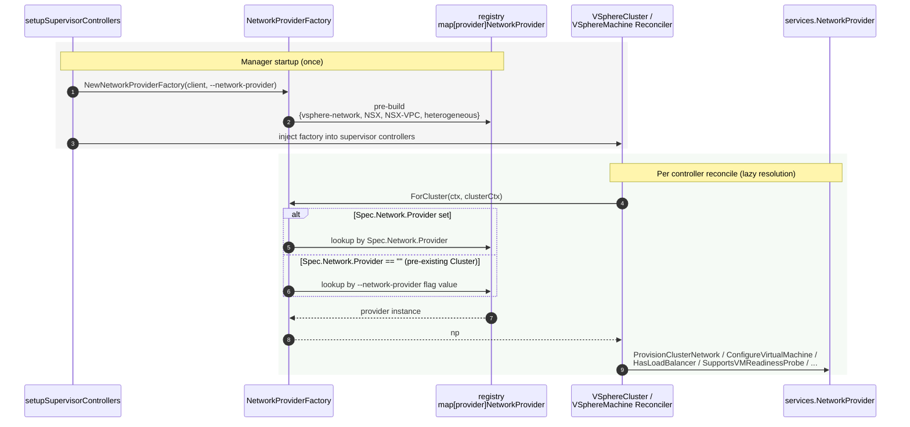

# One-Pager: Per-Cluster Network Provider in CAPV

## Business Problem Being Solved

Today CAPV picks its network provider once, from the `--network-provider`
command-line flag, and holds a single `services.NetworkProvider` instance for
the entire process. This is incompatible with two upcoming features in which a
single CAPV process serves clusters with different providers in the same
Supervisor:

- [VKS Cluster Transition from VDS / NSX T1 to NSX VPC](./One-Pager_Support_VKS_Cluster_Transition_to_VPC.md) -- per-namespace
  provider, and pre-existing Clusters keep their original provider after their
  namespace transitions to VPC.
- [Heterogeneous Network Providers for Supervisor Cluster](./One-Pager_Support_Heterogeneous_Network_Providers_for_Supervisor_Cluster.md) -- a
  Supervisor Cluster whose Nodes attach to networks from multiple providers
  via `VSphereMachine.spec.network.interfaces` pass-through.

CAPV must resolve the network provider per `VSphereCluster`, on demand, at
every reconcile and every admission call.

## Goals

- Resolve the network provider per `VSphereCluster` from
  `VSphereCluster.spec.network.provider` (the source of truth, populated by the
  CAPI Runtime Extension from the per-Cluster network provider label).
- Keep the `--network-provider` flag path bit-for-bit compatible when the new
  feature gate `PerClusterNetworkProvider` is off, and as the fallback for
  pre-existing Clusters whose `spec.network.provider` is empty.
- Add a `heterogeneous` provider that passes
  `VSphereMachine.spec.network.interfaces` through to
  `VirtualMachine.spec.network.interfaces` and skips per-provider defaulting /
  validation.

## Non-Goals

- Authoring the per-Cluster network provider label, the Cluster
  mutating / validating webhooks, or the CAPI Runtime Extension -- these live
  outside CAPV.
- Changing any concrete provider's internal logic
  (`netop_provider.go`, `nsxt_provider.go`, `nsxt_vpc_provider.go`).
- Changing the `services.NetworkProvider` interface signatures.

## Lazy Construction of Network Provider

Instead of holding a single provider instance, CAPV introduces a
`NetworkProviderFactory` that resolves the right `NetworkProvider` for a given
`VSphereCluster` on each controller reconcile. The factory is consumed by
controllers only; webhooks do not need a `NetworkProvider` instance -- they
just need to know the provider's name to pick which per-provider validation
rules to apply, which they read directly from `VSphereCluster.spec.network.provider`
(see [Webhook Validation](#webhook-validation-determining-the-network-provider)).

Two factory implementations, selected at manager startup by the
`PerClusterNetworkProvider` feature gate:

- **`staticNetworkProviderFactory`** (gate off) -- holds one provider built
  from `--network-provider` and always returns it. Behaviorally identical to
  today.
- **`perClusterNetworkProviderFactory`** (gate on) -- holds a small registry of
  pre-built provider singletons (one per kind: `vsphere-network`, `NSX`,
  `NSX-VPC`, `heterogeneous`). `ForCluster` dispatches on
  `VSphereCluster.spec.network.provider`. If the field is empty (pre-existing
  Cluster created before the per-cluster label rollout), it falls back to the
  `--network-provider` flag value.

The factory is constructed once at startup on the supervisor path and threaded
into the supervisor cluster / machine controllers as an explicit parameter
(not stored on `ControllerManagerContext`, to avoid an import cycle and to keep
it swappable in tests). The govmomi path passes `nil`; the supervisor
controllers reject `nil`.



## API Changes

### Feature Gate

| Gate | Default | Purpose |
|---|---|---|
| `PerClusterNetworkProvider` (new) | `false` (alpha) | Master switch. Off: `--network-provider` flag drives everything (today's behavior). On: `VSphereCluster.spec.network.provider` is the source of truth. |

### `VSphereCluster.spec.network.provider`

Add an optional string field to `vmwarev1.Network`:

```yaml
apiVersion: vmware.infrastructure.cluster.x-k8s.io/v1beta1
kind: VSphereCluster
spec:
  network:
    provider: vsphere-network | NSX | NSX-VPC | heterogeneous
```

- Validated by a CRD enum on the four known values.
- **Immutable** once set. Transitioning a brownfield namespace re-labels the
  Cluster but never flips its CAPV provider value (per the VKS transition
  design).
- A new constant `HeterogeneousNetworkProvider = "heterogeneous"` joins the
  existing constants in `pkg/manager/network.go`.
- A printer column is added on `VSphereCluster` to surface the value for
  rollout-time debugging.

## Webhook Validation: Determining the Network Provider

The CAPV webhooks for `VSphereCluster`, `VSphereMachine`, and
`VSphereMachineTemplate` decide which per-provider validation rules to apply.

Resolution order on every admission call, gate on:

1. Load the owning `VSphereCluster` (via the `cluster.x-k8s.io/cluster-name`
   label for `VSphereMachine` / `VSphereMachineTemplate`; itself for
   `VSphereCluster`).
2. If `cluster.Spec.Network.Provider` is non-empty, use it.
3. Otherwise (pre-existing Cluster, empty field), fall back to the
   `--network-provider` flag value -- the same string the webhook uses today.
   Do not write the fallback back into the spec.
4. If the owning cluster cannot be loaded (transient API error), surface the
   error so the apiserver retries the admission.

Per-provider rules (gate on, applied after resolution):

| Provider | `VSphereMachine.spec.network.interfaces` rules |
|---|---|
| `vsphere-network` (VDS) | Unchanged: `primary` forbidden, `secondary` must be `netoperator.vmware.com/Network`. |
| `NSX` (T1) | Unchanged: `interfaces` not supported. |
| `NSX-VPC` | Unchanged: `primary` must be VPC `SubnetSet`; `secondary` may be VPC `SubnetSet` or `Subnet`. |
| `heterogeneous` (new) | Skip the per-provider switch. Keep only structural checks (interface-name uniqueness) and require the `MultiNetworks` gate. |

`VSphereCluster` update admission additionally rejects mutation of
`spec.network.provider` once it is set.

Gate off: behavior is unchanged. The flag-derived `webhook.NetworkProvider`
string is the active provider for all clusters; the field stays for this path
and as the fallback above.

## Controller Changes

### `controllers/vspherecluster_controller.go` (setup)

`AddClusterControllerToManager` gains a
`networkProviderFactory services.NetworkProviderFactory` parameter, required
when `supervisorBased`. The factory is built once in
`setupSupervisorControllers` via `manager.NewNetworkProviderFactory` and
forwarded into `vmware.ClusterReconciler`. `vmware.ClusterReconciler.NetworkProvider`
is replaced by `NetworkProviderFactory`.

### `controllers/vmware/vspherecluster_reconciler.go`

At the top of `reconcileNormal`, resolve once:

```
np, err := r.NetworkProviderFactory.ForCluster(ctx, clusterCtx)
```

Then replace all `r.NetworkProvider.*` uses (`ProvisionClusterNetwork`,
`HasLoadBalancer`, `ReconcileControlPlaneEndpointService`) with `np.*`.
`ReconcileControlPlaneEndpointService` already takes a `NetworkProvider`
argument, so its signature is unchanged.

### `controllers/vspheremachine_controller.go`

`AddMachineControllerToManager` gains the same
`networkProviderFactory services.NetworkProviderFactory` parameter, required
when `supervisorBased`. The reconciler:

- Drops `r.networkProvider`; stores the factory instead.
- Resolves `np` per reconcile after the cluster context is available, and
  threads it into `r.VMService` and into `np.ConfigureVirtualMachine(...)`.

### `pkg/services/vmoperator/vmopmachine.go`

Drop the constructor-time `ConfigureControlPlaneVMReadinessProbe bool`. Make
the per-reconcile call:

```
if np.SupportsVMReadinessProbe() && infrautilv1.IsControlPlaneMachine(...) { ... }
```

`np` is threaded in as a parameter on the `VMService` reconcile method (not
stored on the context struct, to keep behavioral knobs out of state). This is
what lets one CAPV process give VPC and `heterogeneous` clusters no probe,
while VDS and T1 clusters get one -- all at once.

### `pkg/services/vmoperator/control_plane_endpoint.go`

No code change. Already accepts `netProvider services.NetworkProvider`; the
caller now passes the lazily-resolved `np`.

## Resource Behavior Changes

How the reconciled resources behave under each provider value. Existing
providers are unchanged; the new behavior is `heterogeneous`.

### `VirtualMachineService` (control-plane LB)

Driven by `control_plane_endpoint.go`, which short-circuits when
`!netProvider.HasLoadBalancer()`.

| Provider | `HasLoadBalancer()` | Effect |
|---|---|---|
| `vsphere-network` / `NSX` / `NSX-VPC` | `true` | Existing behavior: reconcile a `VirtualMachineService`. |
| `heterogeneous` | **`false`** | Supervisor Cluster's LB is pre-created and `Cluster.spec.controlPlaneEndpoint` is pre-set by the consumer that creates the Supervisor Cluster. CAPV reconciles no `VirtualMachineService`. |

### Cluster Network (provisioning)

Driven by `np.ProvisionClusterNetwork` / `np.GetClusterNetworkName`.

| Provider | `ProvisionClusterNetwork` |
|---|---|
| `vsphere-network` | Resolve the namespace's default `Network` (existing). |
| `NSX` | Auto-create a `VirtualNetwork` (existing). |
| `NSX-VPC` | Reconcile the per-cluster `SubnetSet` (existing). |
| `heterogeneous` | **No-op + set `NetworkReady=True`.** Networks referenced by `interfaces` already exist; CAPV does not provision them. `GetClusterNetworkName`, `GetVMServiceAnnotations`, `VerifyNetworkStatus` are no-ops, mirroring the existing `dummyNetworkProvider`. |

### `VirtualMachine` (per-machine network configuration)

Driven by `np.ConfigureVirtualMachine(ctx, clusterCtx, vsphereMachine, vm)`.

| Provider | `ConfigureVirtualMachine` |
|---|---|
| `vsphere-network` / `NSX` / `NSX-VPC` | Existing per-provider logic. |
| `heterogeneous` | **`VSphereMachine.spec.network.interfaces` is the source of truth.** Deep-copy it into `vm.Spec.Network.Interfaces` verbatim on every reconcile, matching the re-assert pattern every other provider already uses. |

Readiness probe on the control-plane VM:

- Today: a constructor-time bool sourced once from
  `r.networkProvider.SupportsVMReadinessProbe()`.
- After: a per-reconcile call `np.SupportsVMReadinessProbe()`.
- `heterogeneous` returns **`false`** -- there is no
  `VirtualMachineService` and therefore no LB endpoint to probe.

## Backward Compatibility

- **`--network-provider` flag**: continues to work unchanged. Gate off, it
  drives everything. Gate on, it seeds the registry inside the
  per-cluster factory and is the fallback for pre-existing Clusters whose
  `spec.network.provider` is empty.
- **Pre-existing Clusters under gate on**: webhooks and controllers fall back
  to the flag value, so an in-place upgrade from gate-off to gate-on is
  byte-identical for every pre-existing Cluster until / unless its
  `spec.network.provider` is later populated by the Runtime Extension.
- **Mixed deployments**: if the Supervisor capability is off, the upstream
  label is never set, the Runtime Extension never writes
  `spec.network.provider`, and CAPV must run with the gate off (operator
  policy, not enforced inside CAPV).
