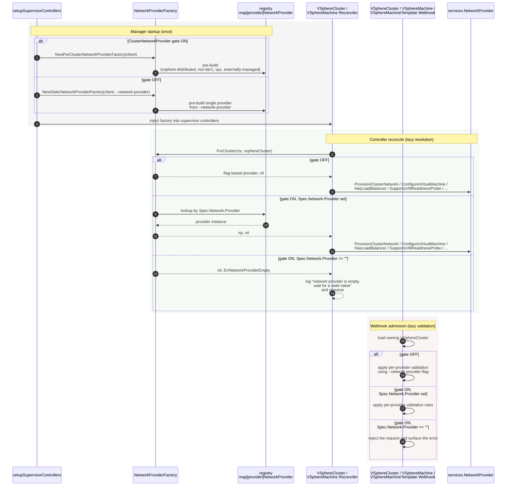
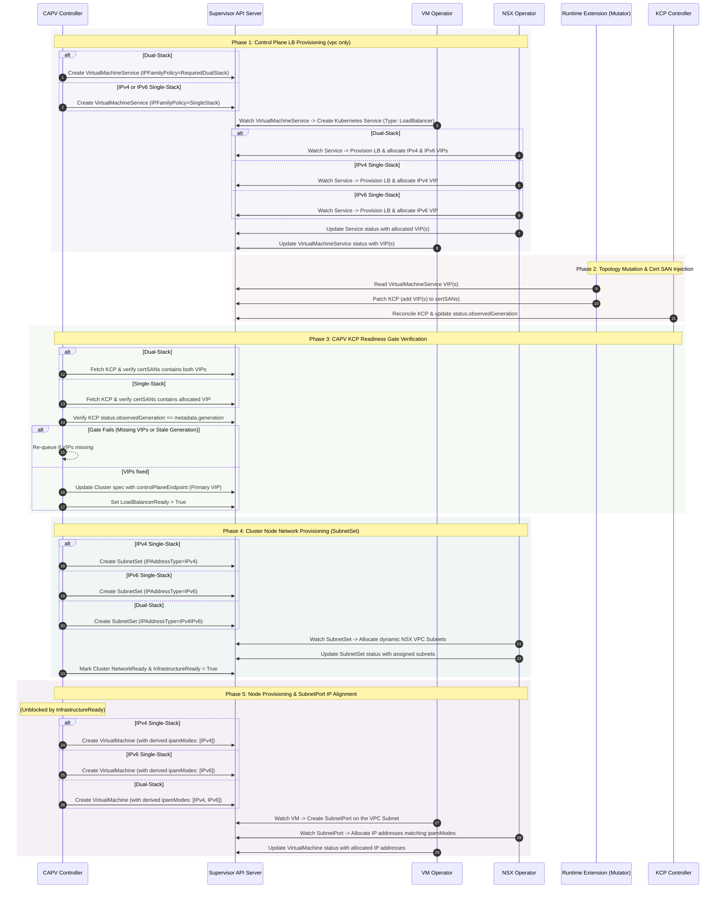

# One-Pager: CAPV Changes for VPC Transition, Supervisor Cluster and IPv6/Dual-Stack

## Business Problem Being Solved
Today CAPV picks its network provider once, from the `--network-provider` command-line flag, and holds a single `services.NetworkProvider` instance for the entire process. This is incompatible with two upcoming VKS features that a single CAPV process must serve at the same time:

- [One-Pager: Support VKS Cluster Transition from VDS / NSX T1 to NSX VPC Network](./one-pager-vks-cluster-transition.md): The network provider is per-namespace, and existing Clusters keep running unchanged; the `networks` variable in their Cluster spec continues to reference the original Network (VDS) or VirtualNetwork (NSX T1) API, even as their underlying infrastructure runs on VPC. CAPV must apply per-provider defaulting, validation, and reconciliation rules on a per-Cluster basis.
- [One-Pager: A externally-managed CAPV Network Provider for the Supervisor Cluster](./one-pager-externally-managed-capv-network-provider.md): The Supervisor Cluster requires a specific network provider, **externally-managed**, that signals to VKS that the bootstrap stack owns the network, and VKS should only attach VMs, skipping network provisioning, load balancer creation, and provider-based validation.
- [One Pager: VKS IPv6 and Dual Stack Support]: Specifically for clusters utilizing the **`vpc`** provider, CAPV must support IPv6 single-stack and IPv4/IPv6 dual-stack deployments. This involves VPC-specific tasks like on-demand `SubnetSet` allocation, dynamic `ipamModes` alignment, and dual-stack control plane coordination.

This document consolidates the CAPV-side changes required by above designs. Everything outside CAPV (the GCC Cluster mutating / validating webhook, the CAPI Runtime Extension, VM Operator) is described in the above documents and is out of scope here.

## Goals
- Resolve the network provider per `VSphereCluster` from `VSphereCluster.spec.network.provider`, on every controller reconcile and every webhook admission call.
- Support the new **externally-managed** provider value for the Supervisor Cluster, which enables straight propagation of network interfaces and skips CAPV’s provisioning logic.
- Support IPv6/Dual-Stack for the `vpc` provider
  - Automatically populate `ipAddressType` and adjust `accessMode` values for `SubnetSet` resources based on the cluster’s CIDR configurations.
  - Derive node network interface configurations directly from the cluster’s primary pod/service CIDRs to ensure dual-stack alignment without redundant configuration on `VSphereMachine` templates.
  - Provision control-plane `VirtualMachineServices` as dual-stack and enforce a secure KCP `certSANs` for dual-stack API Server communication.
- Keep the `--network-provider` flag path bit-for-bit compatible when the feature gate `ClusterNetworkProvider` is off.

## Non-Goals
- Changing VDS or NSX T1 provider’s internal logic (`netop_provider.go`, `nsxt_provider.go`).
- Changing the signatures of the **existing** `services.NetworkProvider` interface methods. One new method, `SkipCreateSupervisorService() bool`, is added to the interface; all existing method signatures stay the same.

## Big Picture
`VSphereCluster.spec.network.provider` is the per-cluster knob, written by the CAPI Runtime Extension. CAPV resolves it on every controller reconcile and every webhook admission call.

```yaml
apiVersion: vmware.infrastructure.cluster.x-k8s.io/v1beta1
kind: VSphereCluster
spec:
  network:
    provider: vsphere-distributed | nsx-tier1 | vpc | externally-managed
```

Two master feature gates control these behaviors:
- ClusterNetworkProvider: Master switch for provider resolution. Off: the --network-provider flag drives everything (today’s behavior). On: VSphereCluster.spec.network.provider is the source of truth.
- IPv6DualStack: Enables specialized VPC orchestration for IPv6/Dual-Stack. This gate only impacts the vpc provider.

## Lazy Resolution of Network Provider
CAPV does not pick its provider at startup. Instead, a `NetworkProviderFactory` resolves the right `NetworkProvider` for a given `VSphereCluster` on every controller reconcile.

The factory holds a small registry of pre-built provider singletons (one per kind: `vsphere-distributed`, `nsx-tier1`, `vpc`, externally-managed). `ForCluster` reads `VSphereCluster.spec.network.provider` and returns the matching singleton.

If `VSphereCluster.spec.network.provider` is empty, CAPV treats the Cluster as "not yet ready for network reconciliation":
- **Controllers** raise an error like `"network provider is empty, wait for a valid value"` and requeue. They do not fall back to the flag, do not pick a default provider, and do not write anything network-related into downstream resources (`VirtualMachineService`, `VirtualMachine`). The reconcile loop simply waits for the Runtime Extension to populate the field.
- **Webhooks** reject the request on `VSphereCluster`, `VSphereMachine`, and `VSphereMachineTemplate`.

When the gate is off, the `--network-provider` flag is the active provider for all clusters; the field is ignored.



### `NetworkProviderFactory`
The factory is consumed by controllers only. Webhooks read `VSphereCluster.spec.network.provider` directly to decide which per-provider validation rules to apply.

```go
// NetworkProviderFactory resolves the services.NetworkProvider for a given
// VSphereCluster on demand. One instance per CAPV process; safe for
// concurrent use.
type NetworkProviderFactory interface {
    // ForCluster returns the NetworkProvider for the given VSphereCluster.
    // Returns ErrNetworkProviderEmpty when the per-cluster factory is in
    // use and Spec.Network.Provider is unset; the caller should requeue
    // and wait for the Runtime Extension to populate the field.
    ForCluster(ctx context.Context, cluster *vmwarev1.VSphereCluster) (services.NetworkProvider, error)
}

// ErrNetworkProviderEmpty is returned by ForCluster when
// VSphereCluster.spec.network.provider is empty under the per-cluster
// factory.
var ErrNetworkProviderEmpty = errors.New("network provider is empty, wait for a valid value")
```

#### `perClusterNetworkProviderFactory` (gate ON)
Pre-builds one provider per kind and dispatches on `VSphereCluster.spec.network.provider`.

```go
func NewPerClusterNetworkProviderFactory(c client.Client) NetworkProviderFactory {
    return &perClusterNetworkProviderFactory{
        registry: map[string]services.NetworkProvider{
            VDSNetworkProvider:           network.NetOpNetworkProvider(c),
            NSXNetworkProvider:           network.NsxtNetworkProvider(c, "false"),
            NSXVPCNetworkProvider:        network.NSXTVpcNetworkProvider(c),
            ExternallyManagedProvider:    network.ExternallyManagedNetworkProvider(c),
        },
    }
}
type perClusterNetworkProviderFactory struct {
    registry map[string]services.NetworkProvider
}

func (f *perClusterNetworkProviderFactory) ForCluster(
    _ context.Context, cluster *vmwarev1.VSphereCluster,
) (services.NetworkProvider, error) {
    provider := cluster.Spec.Network.Provider
    if provider == "" {
        return nil, ErrNetworkProviderEmpty
    }

    if np, ok := f.registry[provider]; ok {
        return np, nil
    }

    return nil, fmt.Errorf("unknown network provider %q", provider)
}
```

#### `staticNetworkProviderFactory` (gate OFF)
Pre-builds a single provider from the `--network-provider` flag and always returns it, regardless of the `VSphereCluster` value -- behaviorally identical to today.

```go
// NewStaticNetworkProviderFactory returns a factory that always returns a
// single provider built from the --network-provider flag value. Used when
// the ClusterNetworkProvider feature gate is off.
func NewStaticNetworkProviderFactory(c client.Client, flagValue string) (NetworkProviderFactory, error) {
    np, err := GetNetworkProvider(context.Background(), c, flagValue)
    if err != nil {
        return nil, fmt.Errorf("building static network provider %q: %w", flagValue, err)
    }
    return &staticNetworkProviderFactory{np: np}, nil
}

type staticNetworkProviderFactory struct {
    np services.NetworkProvider
}

func (f *staticNetworkProviderFactory) ForCluster(
    _ context.Context, _ *vmwarev1.VSphereCluster,
) (services.NetworkProvider, error) {
    return f.np, nil
}
```

## NetworkProvider Changes

### New `SkipCreateSupervisorService` Interface Method
A single new method, `SkipCreateSupervisorService() bool`, is added to the `services.NetworkProvider` interface. It lets a provider opt out of having the ServiceDiscovery controller create the `default/supervisor` Service / Endpoints in the target Cluster. Existing providers (`vsphere-distributed`, `nsx-tier1`, `vpc`) return `false`; only the externally-managed provider returns `true`. See [Changes to Controllers and Reconciled Resources](#changes-to-controllers-and-reconciled-resources) for how the ServiceDiscovery controller consumes it.

### Externally-Managed Network Provider
A new network provider value, **externally-managed**, is introduced specifically for the Supervisor Cluster. This change addresses the difference in networking for Supervisor Cluster 2.0, where the bootstrap stack pre-creates network objects and the kube-apiserver load balancer, meaning VKS should not manage them. The **externally-managed** provider implements a contract where the bootstrap stack owns the network, and VKS/CAPV merely attaches VMs.
Behavior of each method:
- **`HasLoadBalancer() bool`** -- returns `false`. CAPV will not create a `VirtualMachineService` for the control plane VIP; the Cluster’s `spec.controlPlaneEndpoint` is pre-set to the bootstrap-managed VIP.
- **`SupportsVMReadinessProbe() bool`** -- returns `false`. No TCP-based readiness probe is configured on control plane VMs, as this probe is typically used to perform endpoint health checks for the VirtualMachineService-managed Load Balancer.
- **`SkipCreateSupervisorService() bool`** -- returns `true`. The `default/supervisor` Service / Endpoints (reconciled by the ServiceDiscovery controller) proxies a workload VKS Cluster to the Supervisor kube-apiserver and is consumed by the para-virtualized add-ons vSphere CPI and vSphere CSI running inside the VKS Cluster. On the Supervisor Cluster itself vSphere CPI is not deployed and vSphere CSI runs in Supervisor mode, so this Service / Endpoints is not needed and the ServiceDiscovery controller skips it. All other providers return `false`.
- **`ProvisionClusterNetwork(ctx, clusterCtx) error`** -- does not create any network object. Sets `VSphereClusterNetworkReadyCondition` to `True` with reason `VSphereClusterNetworkReadyReason` and returns `nil`.
- **`GetClusterNetworkName(ctx, clusterCtx) (string, error)`** -- returns `""`, `nil`. There is no VKS-managed cluster-scoped network name to report.
- **`GetVMServiceAnnotations(ctx, clusterCtx) (map[string]string, error)`** -- returns `map[string]string{}`, `nil`. CAPV does not create a `VirtualMachineService`, so these annotations are unused; an empty map keeps the call site uniform with other providers.
- **`ConfigureVirtualMachine(ctx, clusterCtx, machine, vm) error`** -- **straight propagation**. Copies `machine.spec.network.interfaces.primary` to `vm.spec.network.interfaces[0]` (named `eth0`) and each entry in `machine.spec.network.interfaces.secondary[*]` to a corresponding entry in `vm.spec.network.interfaces`. For each VM interface:
  - `name`, `mtu`, `network` (kind / apiVersion / name), and `routes` are copied verbatim from the `VSphereMachine` interface.
  - Secondary interfaces have `gateway4: "None"` and `gateway6: "None"` set, matching the existing convention so only the primary interface advertises a default route.
  - If the referenced object is a Subnet, writes the derived IPAM from `Subnet.spec.ipAddressType` (IPv4, IPv6, IPv4IPv6) to VM interface’s `ipamModes` array (`[IPv4]`, `[IPv6]`, or `[IPv4, IPv6]`)
- **`VerifyNetworkStatus(ctx, clusterCtx, obj) error`** -- returns `nil`. This method is currently an orphan on the `NetworkProvider` interface and is not invoked by any CAPV call site; since the externally-managed provider creates no network object there is nothing to verify either way.

### NSX-VPC Network Provider
Under the `IPv6DualStack` gate, the `vpc` provider coordinates the provisioning of both the primary and secondary interfaces based on the cluster’s CIDRs.

Behavior of each method:
- `ProvisionClusterNetwork(ctx, clusterCtx) error` — Auto-creates the VPC `SubnetSet` resource. To support IPv6 and dual-stack orchestration, CAPV utilizes the newly introduced optional field **`ipAddressType`** on the `SubnetSet` CRD (brought by a dependency version bump of the NSX Operator API). CAPV reconciles this field alongside `accessMode` depending on the IP families in the cluster’s pod/service CIDRs:
  - **IPv4 Single-Stack**: Sets `ipAddressType` to `IPv4`. The `accessMode` is left unset (deferring to NSX Operator VPC default logic: `Private` for TEP VPC, `Public` for TEPless VPC).
  - **IPv6 Single-Stack**: Sets `ipAddressType` to `IPv6`. The `accessMode` is left unset (accessMode only applies to IPv4 Stack. Direct ingress traffic is blocked by default via standard NSX security policies; the only permitted route is through a LoadBalancer service).
  - **Dual-Stack**: Sets `ipAddressType` to `IPv4IPv6` (or `DualStack` based on capability query checks) and `accessMode` unset (as the access mode configuration only impacts IPv4 addresses in dual stack, nsx-operator will set it following the same pattern as IPv4 Single Stack).
- `ConfigureVirtualMachine(ctx, clusterCtx, machine, vm) error` — Even when a dual-stack `SubnetSet` is provisioned, attached virtual machines require individual ports to explicitly opt-in to dual stack. To avoid duplicating configuration on high-cardinality `VSphereMachine` templates, CAPV automatically derives the VM IP configuration from the cluster’s pod/service CIDRs using `DeriveIPAMModes`:

```go
// DeriveIPAMModes analyzes the cluster CIDR blocks to decide VM interface IPAM configurations
// This logic is exclusive to the NSX-VPC network provider.
func DeriveIPAMModes(cluster *clusterv1.Cluster) []string {
    if IsDualStack(cluster) {
        return []string{"IPv4", "IPv6"}
    }
    if IsIPv6SingleStack(cluster) {
        return []string{"IPv6"}
    }
    return []string{"IPv4"}
}
```

CAPV writes this derived array to `VirtualMachine.spec.network.interfaces[*].ipamModes` during the `ConfigureVirtualMachine` execution, which the VM Operator then propagates to the underlying `SubnetPort`.

## API Changes

### Feature Gate

| Gate | Default | Purpose |
| --- | --- | --- |
| `ClusterNetworkProvider` (new) | `false` (alpha) | Off: `--network-provider` flag drives everything via `staticNetworkProviderFactory`. On: `VSphereCluster.spec.network.provider` is the source of truth. |
| `IPv6DualStack` (new) | `false` (alpha) | Controls dynamic configuration of single/dual-stack properties across `SubnetSet`, `VirtualMachine`, and `VirtualMachineService`. |

### `VSphereCluster.spec.network`
Add an optional `provider` field (`vsphere-distributed | nsx-tier1 | vpc | externally-managed`) populated by the CAPI Runtime Extension.

```yaml
apiVersion: vmware.infrastructure.cluster.x-k8s.io/v1beta1
kind: VSphereCluster
spec:
  network:
    provider: vsphere-distributed | nsx-tier1 | vpc | externally-managed
```

- `provider` is optional and validated by a CRD enum on above four known values.
- `provider` is **immutable once set to a non-empty value.** The empty-to-non-empty write is permitted, allowing the Runtime Extension to populate the field after a Cluster is created or after a VCF 9.2 upgrade (when the field is initially empty). This allowance ensures that transitioning a brownfield namespace never flips its CAPV provider value, per the VKS transition design.

## Changes to Validation Webhooks
The CAPV webhooks for `VSphereCluster`, `VSphereMachine`, and `VSphereMachineTemplate` decide which per-provider validation rules to apply.

### Resolution Order (gate ON)
On every admission call:
1. Load the owning `Cluster` (via the `cluster.x-k8s.io/cluster-name` label from `VSphereMachine` / `VSphereMachineTemplate`), then load the `VSphereCluster` via `Cluster.spec.infrastructureRef`.
2. If (`VSphereCluster.Spec.Network.Provider` is empty), reject the request and surface the error.
3. Else if `VSphereCluster.Spec.Network.Provider` is "**externally-managed**", **skip provider-based validation** and run only schema-level checks.
4. Else perform per-provider validation.
5. If the owning `VSphereCluster` cannot be loaded, reject the request and surface the error.

### Per-Provider Validation Rules (unchanged)
Applied only when the provider is resolved and is **not** externally-managed.

| Provider | `VSphereMachine.spec.network.interfaces` rules |
| --- | --- |
| `vsphere-distributed` (VDS) | `primary` forbidden; `secondary` must be `netoperator.vmware.com/Network`. |
| `nsx-tier1` (T1) | `interfaces` not supported. |
| `vpc` | `primary` must be VPC `SubnetSet`; `secondary` may be VPC `SubnetSet` or `Subnet`. |

### `VSphereCluster` Update Admission
- Rejects mutation of `spec.network.provider` once it is set to a non-empty value.

### Gate OFF
Behavior is unchanged. The flag-derived `webhook.NetworkProvider` string is the active provider for all clusters; `spec.network.provider` is ignored.

## Changes to Controllers and Reconciled Resources
This section describes how the reconciled resources (`VirtualMachineService`, the cluster-scoped network object, `VirtualMachine`) behave under each combination of provider and option, and which controller code changes deliver that behavior.

### Controller Wiring
Both `VSphereCluster` and `VSphereMachine` reconcilers are wired with a `NetworkProviderFactory` built once in `setupSupervisorControllers`.
1. **VSphereCluster controller**: The only change is to **call `factory.ForCluster()` on every reconciliation to get the provider instance `np`**, controller logic does not change. It then runs `np.ProvisionClusterNetwork(...)` for Cluster network provisioning and creates `VirtualMachineService` for control-plane Loadbalancer.
2. **VSphereMachine controller**: The only change is to **call `factory.ForCluster()` on every reconciliation to get the provider instance `np`**, controller logic does not change: For each machine:
   - Call `np.ConfigureVirtualMachine(...)` for interface configurations.
   - For control-plane machines, configure the TCP readiness probe if `np.SupportsVMReadinessProbe() == true`.

### Unified Single/Dual-Stack Orchestration Sequence (NSX-VPC Only)
When the `IPv6DualStack` gate is active and the resolved network provider is `vpc`, the CAPV controllers coordinate with the VM Operator, NSX Operator, and Runtime Extension in a strict, multi-phase operational sequence:



### `VirtualMachineService` (control-plane LB)
Reconciled by `control_plane_endpoint.go`, which short-circuits when `!netProvider.HasLoadBalancer()`. The Supervisor Cluster suppresses the LB by pre-setting `Cluster.spec.controlPlaneEndpoint` (which already short-circuits LB creation in CAPV today) -- not via a NetworkProvider toggle. No code change here.

#### **Dual-Stack Control Plane Integration(NSX-VPC Only)**
When `IPv6DualStack` is enabled, CAPV executes a multi-step workflow to securely set up dual-stack control-plane load balancing:
- VirtualMachineService Configuration: CAPV configures the control plane `VirtualMachineService` with `spec.ipFamilyPolicy` set to `RequiredDualStack` (or `SingleStack` as appropriate) and orders `spec.ipFamilies` prioritizing the Cluster’s primary family. *(Note: `ipFamilies` and `ipFamilyPolicy` are introduced in VM Operator API v1alpha6. CAPV resolves the version at runtime).*
- LB VIP Synchronization: For dual-stack, CAPV requires **both** an IPv4 and an IPv6 VIP to be present in the load balancer ingress status before progressing.
- KCP Readiness Gate (TLS Integrity): Before setting the cluster endpoint or marking `LoadBalancerReady` to true, CAPV fetches the `KubeadmControlPlane` (KCP) and verifies:
  - certSANs: KCP’s `spec.kubeadmConfigSpec.clusterConfiguration.apiServer.certSANs` contains both VIPs (allocated and injected via the Runtime Extension’s mutator). If missing, the controller sets `LoadBalancerReady` to `false` with the reason `WaitingForKCPReady` and requeues.
  - observedGeneration: KCP’s `status.observedGeneration` matches its `metadata.generation`, confirming the KCP controller has reconciled the injected `certSANs`.
- Endpoint Selection: Once the gate passes, CAPV sets the Cluster’s `controlPlaneEndpoint` to the primary VIP and marks the load balancer ready.

### Cluster Network
Driven by `np.ProvisionClusterNetwork`.

| Provider | Effect |
| --- | --- |
| `vsphere-distributed` | Resolve the namespace’s default `Network`. |
| `nsx-tier1` | Auto-create a `VirtualNetwork`. |
| `vpc` | Auto-create a `SubnetSet` if `VSphereCluster.spec.network.nsxVPC.createSubnetSet` is true. Under `IPv6DualStack` gate: CAPV configures `SubnetSet` `ipAddressType` and `accessMode` based on the cluster’s CIDR blocks. |
| externally-managed | **No-op.** Set `NetworkReady` to `True` immediately. |

Today this is the Supervisor Cluster’s path: its workload network is a pre-created Network / VirtualNetwork / Subnet referenced by `networks.interfaces`, so CAPV must not try to provision a per-cluster network on top of it.

#### **SubnetSet Layout Configurations(NSX-VPC Only)**
When `IPv6DualStack` is active, CAPV automates the creation of VPC-scoped `SubnetSet` resources. To enable this integration, CAPV bumps its imported dependency version of the NSX Operator API.

The NSX Operator expands the `SubnetSet` CRD to introduce a new optional field **`ipAddressType`**, which dictates the IP protocol family of the on-demand subnets. CAPV automatically reconciles this field alongside the `accessMode` based on the cluster’s configured pod and service CIDR blocks:

| Cluster IP Stack | Derived SubnetSet `ipAddressType` | Derived SubnetSet `accessMode` | Operational Isolation Justification |
| --- | --- | --- | --- |
| **IPv4 Single-Stack** | `IPv4` | Unset (NSX Operator would set it based on VPC TEP mode) | Access mode is deferred to NSX Operator defaulting (`Private` for TEP, `Public` for TEPless). |
| **IPv6 Single-Stack** | `IPv6` | Unset | Access mode is for IPv4 stack only. |
| **Dual-Stack** | `IPv4IPv6` | Unset | In dual-stack environments, the configured access mode dictates IPv4 addressing properties only; the IPv6 stack remains public but secures equivalent isolation. |

### `VirtualMachine` (per-machine network configuration)
Driven by per-provider logic `np.ConfigureVirtualMachine`.
- **externally-managed Provider**: Provider performs straight propagation and sets `ipamModes` derived from `Subnet.spec.ipAddressType` when the referenced object is a Subnet.
- **NSX-VPC Provider**: Sets the `ipamModes` derived IPAM array (`[IPv4]`, `[IPv6]`, or `[IPv4, IPv6]`) from Cluster IP Stack. The VM Operator then propagates this to the underlying `SubnetPort`.

### Control-Plane VM Readiness Probe
Driven by `np.SupportsVMReadinessProbe()`. The **externally-managed** provider returns `SupportsVMReadinessProbe() = false`.

### ServiceDiscovery Controller (`default/supervisor` Service)
The ServiceDiscovery controller reconciles a headless `default/supervisor` Service and its Endpoints inside the target Cluster, pointing them at the discovered Supervisor kube-apiserver VIP/FIP. The para-virtualized add-ons vSphere CPI and vSphere CSI, which run inside a workload VKS Cluster, use this Service to reach the Supervisor kube-apiserver.

Driven by `np.SkipCreateSupervisorService()`:
- The controller resolves the Cluster’s provider via `factory.ForCluster()` (same lazy resolution as the other supervisor controllers; empty `spec.network.provider` requeues with `ErrNetworkProviderEmpty`).
- When `np.SkipCreateSupervisorService()` returns `true` (the **externally-managed** provider), the controller skips creating/patching the `default/supervisor` Service / Endpoints and marks `ServiceDiscoveryReady = True`. The Supervisor Cluster does not deploy vSphere CPI and runs vSphere CSI in Supervisor mode, so this Service is not needed.
- For all other providers the method returns `false` and the controller behavior is unchanged.

When the `ClusterNetworkProvider` gate is off, the flag-derived provider is used (today’s behavior), and the built-in providers all return `false`, so the Service is always created -- bit-for-bit compatible with today.

## Backward Compatibility
- **`--network-provider` flag.** Continues to work unchanged. Gate off, it drives everything via `staticNetworkProviderFactory`. Gate on, it is ignored at runtime; per-cluster resolution is driven entirely by `VSphereCluster.spec.network.provider`.
- **Pre-existing Clusters under gate on.** They start with an empty `spec.network.provider`. Controllers requeue with `"network provider is empty, wait for a valid value"` and webhooks reject the request until the CAPI Runtime Extension populates the field, after which normal per-provider behavior resumes.
- **The externally-managed provider gating.** The new externally-managed provider is selected only when the namespace has the `clusters.kubernetes.vmware.com/supervisor-namespace: "true"` annotation.
- **VM Operator API Compatibility**: If the VM Operator API version running on the Supervisor is earlier than v1alpha6, the controller will report an error stating that IPv6 dual-stack is not supported, rather than falling back to single-stack logic.
- **Brownfield Capabilities**: Existing single-stack IPv4 clusters are unaffected. The `IPv6DualStack` feature gate is enabled exclusively when Capability checking verifies Supervisor-level support.
